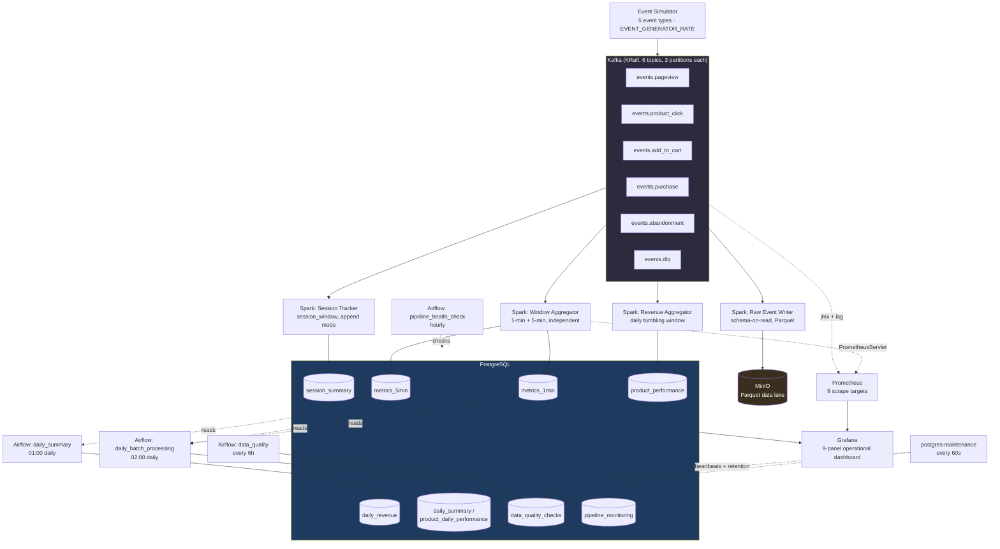

# Architecture

Deep technical reference for StreamMart. If you just want to run the thing, see
[RUNBOOK.md](RUNBOOK.md). If you want the reasoning behind specific choices, see
[DESIGN_DECISIONS.md](DESIGN_DECISIONS.md). This document is "what the system does and how the
pieces fit," kept in sync with the actual code — see [ENGINEERING.md](ENGINEERING.md) for the
per-component verification status if you want to know exactly how confident to be in any given
claim below.

## Contents

- [System diagram](#system-diagram)
- [Data flow, narrated](#data-flow-narrated)
- [Table ownership](#table-ownership)
- [Kafka topics](#kafka-topics)
- [Spark streaming jobs](#spark-streaming-jobs)
- [Airflow DAGs (batch layer)](#airflow-dags-batch-layer)
- [PostgreSQL maintenance job](#postgresql-maintenance-job)
- [MinIO data lake layout](#minio-data-lake-layout)
- [Observability stack](#observability-stack)
- [Tech stack](#tech-stack)
- [Repository layout](#repository-layout)
- [Limitations & known gaps](#limitations--known-gaps)

---

## System diagram



*(GitHub renders Mermaid diagrams natively — no image export needed. If you're reading this in a
renderer that doesn't support Mermaid, the [ASCII version](#data-flow-narrated) below covers the
same ground.)*

---

## Data flow, narrated

```
Event Simulator (Python, Faker-based)
     │  5 event types, session-state machine, EVENT_GENERATOR_RATE
     ▼
Kafka (KRaft mode, 6 topics, 3 partitions each, key = session_id)
     │
     ├──► Spark: Raw Event Writer ─────────────► MinIO (Parquet)
     │         partitioned by year/month/day/event_type, snappy,
     │         raw JSON payload preserved (schema-on-read)
     │
     ├──► Spark: Window Aggregator ────────────► Postgres metrics_1min
     │      │   1-min tumbling window, watermark 2min, 30s trigger
     │      └───────────────────────────────────► Postgres metrics_5min
     │          5-min tumbling window (independent aggregation off the
     │          same parsed stream — NOT summed from metrics_1min,
     │          see DESIGN_DECISIONS.md), 60s trigger
     │
     ├──► Spark: Session Tracker ──────────────► Postgres session_summary
     │         session_window (30-min gap), watermark 40min, outputMode
     │         "append" (Spark doesn't support "update" mode for session
     │         windows) — a session lands ~40-70min after its last event
     │
     └──► Spark: Revenue Aggregator ───────────► Postgres product_performance
               events.purchase only, exploded line items, daily tumbling
               window grouping (bounded state), psycopg2 upsert

PostgreSQL
     │
     ├──► postgres-maintenance (every 60s, sql/maintenance.sql):
     │         DQ heartbeat checks (distinct check_name prefix from Airflow's)
     │         pipeline heartbeat
     │         retention deletes
     │         (does NOT write metrics_5min/daily_revenue/product_performance
     │         — each has exactly one writer, see Table Ownership below)
     │
     └──► Airflow DAGs (batch/reconciliation layer):
               • daily_batch_processing @ 02:00 → daily_summary, product_daily_performance
               • daily_summary          @ 01:00 → daily_revenue (authoritative)
               • data_quality           every 6h → data_quality_checks
               • pipeline_health_check  hourly   → freshness/connectivity alerts

Grafana ◄── PostgreSQL (dashboards) + Prometheus (infra metrics)
Prometheus ◄── kafka-jmx-exporter, kafka-exporter (consumer lag — see Limitations
                for why it won't show data for Spark's own consumption),
                postgres-exporter, Spark master/worker/applications (PrometheusServlet)
Loki ◄── promtail ◄── all container logs
```

---

## Table ownership

Every table has exactly one writer. This is a project convention enforced by discipline, not by
the database — an earlier version of this pipeline had two independent processes writing
`product_performance` and `daily_revenue`, which is a guaranteed collision, not a rare one. See
[DESIGN_DECISIONS.md](DESIGN_DECISIONS.md#why-every-table-has-exactly-one-writer) for the full
reasoning.

| Table | Sole Writer | Cadence |
|---|---|---|
| `metrics_1min` | `window_aggregator.py` | ~30s |
| `metrics_5min` | `window_aggregator.py` | ~60s |
| `session_summary` | `session_tracker.py` | ~1min (append-mode) |
| `product_performance` | `revenue_aggregator.py` | ~30s |
| `daily_revenue` | Airflow `daily_summary` DAG | daily @ 01:00 |
| `daily_summary`, `product_daily_performance` | Airflow `daily_batch_processing` DAG | daily @ 02:00 |
| `data_quality_checks` | Airflow `data_quality` DAG (business-rule checks) + `postgres-maintenance` (lightweight heartbeats, distinct `check_name` prefix) | every 6h / every 60s |
| `pipeline_monitoring` | Every DAG + `postgres-maintenance` (append-only event log — intentionally multi-writer, each under its own `job_name`) | varies |

There is deliberately **no `events_raw` table** — raw, per-event data lives in MinIO as Parquet,
not Postgres.

---

## Kafka topics

The simulator generates 5 event types onto 5 topics, plus a dead-letter topic:

| Topic | Event | Key Fields |
|---|---|---|
| `events.pageview` | Page visit | session_id, user_id, page_url, device_type |
| `events.product_click` | Product viewed | product_id, product_name, product_price |
| `events.add_to_cart` | Cart action | product_id, quantity, cart_total |
| `events.purchase` | Completed order | order_id, items[], total, payment_method |
| `events.abandonment` | Cart abandoned | cart_total, abandonment_stage |
| `events.dlq` | Dead letter | exists in the schema, not yet a fully wired-up DLQ — see Limitations |

All topics: 3 partitions, key = `session_id` (so all of one session's events land on the same
partition, preserving order for downstream sessionization).

---

## Spark streaming jobs

**Window Aggregator** (`spark_jobs/window_aggregator.py`)
- Reads all 5 event topics
- Computes **two independent** windowed aggregations off the same parsed stream: 1-minute (→ `metrics_1min`, 30s trigger) and 5-minute (→ `metrics_5min`, 60s trigger) — count, unique sessions, unique users per event type
- 5-minute metrics are computed directly from the event stream, not derived from `metrics_1min` — summing five pre-aggregated `approx_count_distinct` values across windows does not produce a valid 5-minute distinct count
- Watermark: 2 minutes (handles late data)
- Writes via psycopg2 `ON CONFLICT (window_start, event_type) DO UPDATE`

**Session Tracker** (`spark_jobs/session_tracker.py`)
- Groups events by `session_id` using Spark's `session_window` (30-minute inactivity gap)
- Computes per-session KPIs: funnel counts, conversion flag, revenue, duration
- Runs in `outputMode("append")` — Spark does not support `update` mode for session-window aggregations. A session is emitted once, after the 40-minute watermark confirms it's closed, so it appears in `session_summary` roughly 40-70 minutes after its last event, not incrementally
- Writes via psycopg2 `ON CONFLICT (session_id) DO UPDATE` (a restart safety net — under normal operation this is effectively insert-only)

**Raw Event Writer** (`spark_jobs/raw_event_writer.py`)
- Writes all events as Parquet to MinIO, partitioned by `year/month/day/event_type`
- Preserves the full raw JSON payload as-is (schema-on-read) rather than exploding it into typed columns, so producer-side field changes never break this job
- Snappy compression; immutable audit trail for reprocessing

**Revenue Aggregator** (`spark_jobs/revenue_aggregator.py`)
- Reads only `events.purchase`, explodes line items
- Computes daily product-level revenue, units sold, and order count, grouped by a real daily tumbling window (not just a derived date column — the watermark can only evict state for a grouping key that includes an actual `window()` column)
- Sole writer of `product_performance`; writes via psycopg2 `ON CONFLICT (product_id, date) DO UPDATE`

---

## Airflow DAGs (batch layer)

| DAG | Schedule | Purpose |
|---|---|---|
| `streammart_daily_batch_processing` | 02:00 daily | Joins metrics_1min + session_summary → daily_summary; denormalizes product_performance → product_daily_performance |
| `streammart_daily_summary` | 01:00 daily | Revenue rollup from session_summary → daily_revenue (authoritative) |
| `streammart_data_quality` | Every 6 hours | Completeness, accuracy, timeliness, and cross-pipeline consistency checks |
| `streammart_pipeline_health_check` | Hourly | Connectivity, freshness, and storage health checks |

All four DAGs use the `streammart_postgres` connection, which `airflow-init` provisions
automatically on first boot — no manual setup required. All start paused by design; unpause
manually in the Airflow UI when you want them running on schedule.

---

## PostgreSQL maintenance job

`sql/maintenance.sql` runs every 60 seconds inside the `postgres-maintenance` container and:
1. Writes lightweight DQ heartbeat checks (distinct from the Airflow DAG's business-rule checks) into `data_quality_checks`
2. Inserts a pipeline heartbeat into `pipeline_monitoring`
3. Runs retention deletes (keeps 14 days of `metrics_5min`, 3 days of `metrics_1min`/`session_summary`)

It does **not** compute `metrics_5min`, `daily_revenue`, or `product_performance` — each of those
has exactly one writer elsewhere (see [Table ownership](#table-ownership)). This file used to be
called `rollups.sql` and did compute `metrics_5min`; see
[DESIGN_DECISIONS.md](DESIGN_DECISIONS.md#why-metrics_5min-is-computed-independently-not-rolled-up-from-metrics_1min)
for why that moved to Spark.

---

## MinIO data lake layout

```
s3a://raw-events/events/year=YYYY/month=M/day=D/event_type=<type>/*.snappy.parquet
```

Partitioned for efficient date-range and event-type-filtered reads. Raw JSON payload preserved
verbatim per record (see Raw Event Writer above) — this is the layer you'd reprocess from if
downstream logic ever needs to change retroactively.

---

## Observability stack

**Grafana** — one dashboard, 9 panels: event rate, conversion rate, cart abandonment rate, data
quality pass rate, events time series, totals by type, conversion funnel, last 20 sessions, and
an observability-stack target-health panel. Two datasources (PostgreSQL, Prometheus), both
provisioned automatically and confirmed live-healthy.

**Prometheus** — 9 scrape targets, all confirmed `up` in live validation: `kafka-jmx`,
`kafka-exporter`, `minio`, `postgres`, `prometheus` (self), `spark-master`, `spark-applications`,
and two `spark-worker` entries. Spark metrics come from Spark's own built-in PrometheusServlet
sink (`config/spark/metrics.properties`), not an external agent.

**Loki + Promtail** — centralized log aggregation across every container.

> **Known gap:** `kafka-exporter`'s consumer-group-lag metrics won't show data for any of the 4
> Spark jobs specifically. Structured Streaming tracks progress via its own checkpoint files, not
> Kafka's `__consumer_offsets` — confirmed live (only a `schema-registry` consumer group shows
> up). Real lag visibility for these jobs would need a `StreamingQueryListener`-based offset
> committer or reading each job's checkpoint offset log directly. Tracked in
> [ENGINEERING.md](ENGINEERING.md)'s roadmap.

---

## Tech stack

| Layer | Technology | Version |
|---|---|---|
| Message Broker | Apache Kafka (KRaft, no ZooKeeper) | 7.5.3 |
| Stream Processing | Apache Spark Structured Streaming | 3.5.0 |
| Data Lake | MinIO (S3-compatible) | latest |
| Warehouse | PostgreSQL | 15 |
| Orchestration | Apache Airflow | 2.8.0 |
| Dashboards | Grafana | latest |
| Metrics / Logs | Prometheus + Loki | latest |
| Language | Python | 3.11 |

---

## Repository layout

```
streammart/
├── README.md                 # Start here
├── ARCHITECTURE.md           # ← you are here
├── DESIGN_DECISIONS.md       # Technology choices and pipeline-specific tradeoffs
├── RUNBOOK.md                 # Command-by-command first-run guide, real verified output
├── ENGINEERING.md             # Engineering memory: status, roadmap, coding standards
├── src/
│   ├── simulator/              # Event generator (Faker-based clickstream)
│   ├── spark_jobs/             # 4 PySpark Structured Streaming jobs
│   ├── airflow_dags/           # 4 Airflow DAGs (batch/reconciliation layer)
│   └── utils/                  # Shared Postgres/MinIO client helpers
├── sql/
│   ├── init_postgres.sql       # Schema DDL (tables, indexes, mat views)
│   └── maintenance.sql         # 60s heartbeat + retention job
├── config/
│   ├── grafana/                  # Provisioned dashboards and datasources
│   ├── prometheus/               # Scrape config, incl. Spark + kafka-exporter targets
│   ├── spark/                    # Spark PrometheusServlet metrics config
│   ├── promtail/, loki/          # Log shipping
│   └── jmx/                      # Kafka JMX exporter rules
├── schemas/                    # Avro schemas (drafted, not yet wired in — see Limitations)
├── tests/
│   ├── unit/                     # No Docker required
│   └── integration/               # Requires a running stack; skips gracefully if not
├── .github/workflows/ci.yml    # Lint, unit tests, compose smoke test
├── docker-compose.yml           # Full stack (3 profiles: default, obs, orchestration)
├── Dockerfile.event-generator
└── .env.example                  # Copy to .env and fill in credentials
```

---

## Limitations & known gaps

- **Schema Registry**: deployed and running, but the pipeline currently uses JSON, not Avro — the schemas in `schemas/` are drafted but not yet wired into the producer or consumers.
- **Dead Letter Queue**: the `events.dlq` topic exists but isn't a fully functional DLQ yet — it's only populated on local producer exceptions, and nothing consumes/replays it.
- **Exactly-once end-to-end**: Kafka → Spark uses at-least-once delivery. psycopg2 upserts make writes idempotent, but duplicate events from the producer itself are not deduplicated.
- **No secrets manager**: credentials are passed via environment variables (`.env`, gitignored). In production, use Vault or AWS/GCP Secrets Manager instead.
- **Consumer lag monitoring**: see the Observability section above.
- **Spark cluster**: runs one master + two workers by default. Scale further by adding more `spark-worker-N` services in `docker-compose.yml`.
- **No benchmarks published yet**: throughput/latency numbers under load haven't been measured and published.
- **Alertmanager**: Prometheus is scraping real metrics; alerting rules on top of it are the one open High-priority roadmap item.

Full, continuously-updated status and roadmap: [ENGINEERING.md](ENGINEERING.md).
