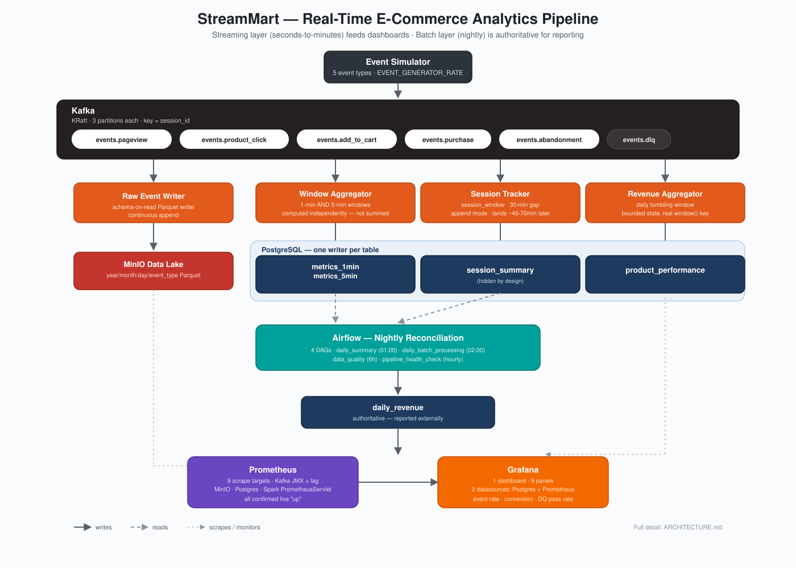
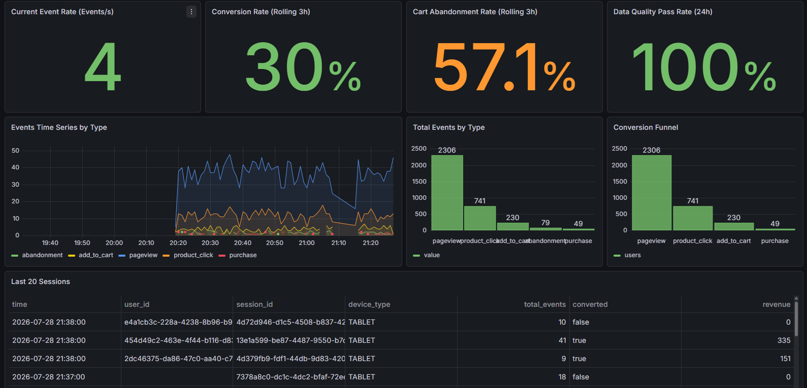
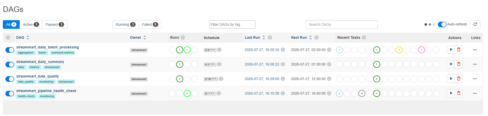
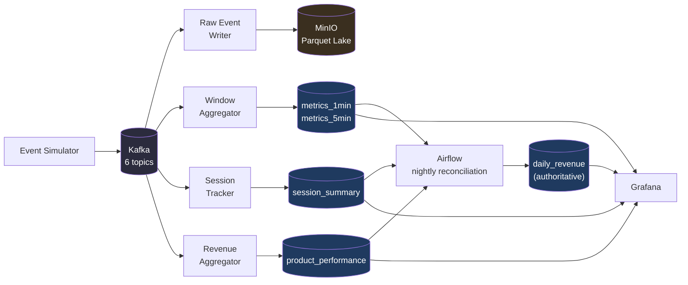

<!-- The CI badge below points at github.com/streammart/streammart — a placeholder org/repo.
     Update it to match wherever this actually gets pushed, or the badge will never resolve. -->
<div align="center">

# StreamMart

### Real-Time E-Commerce Analytics Platform

**Clickstream ingestion → Spark Structured Streaming → Postgres + a MinIO data lake → Grafana, with Airflow reconciling the numbers every night.**

[](.github/workflows/ci.yml)
[](LICENSE)
[](requirements.txt)
[](docker-compose.yml)
[](src/spark_jobs)
[](src/airflow_dags)
[](sql/init_postgres.sql)
[](docker-compose.yml)

[Quick Start](#-quick-start) · [Architecture](ARCHITECTURE.md) · [Runbook](RUNBOOK.md) · [Design Decisions](DESIGN_DECISIONS.md) · [Roadmap](#-roadmap)

</div>

---

## Overview

StreamMart simulates a mid-size e-commerce platform's clickstream — pageviews, product clicks,
cart activity, purchases, abandonment — and processes it through the same architectural pattern
real streaming platforms use: a fast, approximate streaming layer for operational dashboards,
and a slower, authoritative batch layer for reporting. Four independent Spark Structured
Streaming jobs consume the same Kafka topics and write to different tables, each with exactly one
owner, no shared state, no collisions.

It's a **27-service** Docker Compose stack — Kafka, Spark (a real 2-worker cluster, not
`local[*]`), PostgreSQL, MinIO, Airflow, Grafana, and Prometheus/Loki — designed to be read
end-to-end in an afternoon and run end-to-end in one command.

<div align="center">



<sub>Hand-built diagram, kept in sync with the actual pipeline — not a stock illustration. Full detail: <a href="ARCHITECTURE.md">ARCHITECTURE.md</a></sub>

</div>

<table align="center">
<tr>
<td align="center" width="180">📊<br/><b>Dashboard</b><br/><sub><a href="docs/images/README.md">add screenshot</a></sub></td>
<td align="center" width="180">🌀<br/><b>Airflow DAGs</b><br/><sub><a href="docs/images/README.md">add screenshot</a></sub></td>
<td align="center" width="180">🎬<br/><b>Demo GIF</b><br/><sub><a href="docs/images/README.md">add recording</a></sub></td>
</tr>
</table>

<!--
  Screenshots and a demo GIF are intentionally not embedded yet — see
  docs/images/README.md for exactly what to capture and where to drop it.
  Once added, uncomment and fill in:
  
  
  
-->

---

## ✨ Key Features

| | |
|---|---|
| 🔀 **Two independent streaming granularities** | `metrics_1min` and `metrics_5min` are each computed directly from the raw Kafka stream — not one derived from the other, because summing pre-aggregated approximate-distinct counts across windows is mathematically wrong. See [why](DESIGN_DECISIONS.md#why-metrics_5min-is-computed-independently-not-rolled-up-from-metrics_1min). |
| 🔒 **Single-writer-per-table discipline** | Every Postgres table has exactly one process allowed to write to it — enforced by convention and documented in a table-ownership matrix, after an earlier version of this pipeline learned the hard way what happens without one. |
| ⏱️ **Honest session windows** | User sessions use Spark's `session_window` (30-min inactivity gap) instead of a tumbling window that would split real sessions at arbitrary boundaries — and the README tells you the real cost: sessions land 40-70 minutes after their last event, by design, not by bug. |
| 🔁 **Idempotent everywhere** | Every streaming write path uses `psycopg2` + `ON CONFLICT DO UPDATE`, not Spark's JDBC sink — because JDBC's `append` mode has no upsert story, and every job here can legitimately re-emit a window after a restart. |
| 🛡️ **Bounded state, on purpose** | Every windowed aggregation groups by a real `window()`/`session_window()` column, not a derived date column — the one thing that lets Spark's watermark actually evict old state instead of growing memory forever. |
| 📈 **Full observability, not a demo of it** | 9 real Prometheus scrape targets (Kafka JMX, Kafka consumer lag, MinIO, Postgres, Spark master/worker/applications via its built-in PrometheusServlet), a 9-panel Grafana dashboard, and centralized logs via Loki — all confirmed live, not just configured. |
| 🧪 **Live-validated, not just unit-tested** | 36 automated tests, plus a documented multi-hour live validation that found and fixed 9 real bugs invisible to code review — including one in the Spark job an earlier audit called "the one that worked correctly." See [what was actually found](RUNBOOK.md#12-what-was-fixed-to-make-this-runbook-possible). |
| 📝 **A runbook with real output, not invented examples** | [RUNBOOK.md](RUNBOOK.md) shows the actual command output from an actual run — actual timings (Spark cluster healthy in ~14s, all 4 jobs registered by ~156s), actual measured memory (~6.4 GB core / ~7.9 GB core+obs), not estimates. |

---

## Architecture at a Glance



**Streaming layer** (4 Spark jobs, seconds-to-minutes latency) feeds operational dashboards.
**Batch layer** (Airflow, nightly) is what you'd actually report externally. Neither pretends to
be the other. Full system diagram, table ownership, and every job's watermark/trigger/output-mode
settings: **[ARCHITECTURE.md](ARCHITECTURE.md)**.

---

## 🚀 Quick Start

Get the core pipeline running in under 2 minutes of commands (the Spark jobs take a few minutes
longer to finish downloading dependencies and start processing — see
[RUNBOOK.md](RUNBOOK.md) for real, timed output of the whole thing).

```bash
git clone <repo-url> && cd streammart
cp .env.example .env
# Edit .env: set real values for POSTGRES_PASSWORD, MINIO_ACCESS_KEY/SECRET_KEY,
# AIRFLOW_ADMIN_PASSWORD, GRAFANA_ADMIN_PASSWORD, AIRFLOW__CORE__FERNET_KEY.
# There are no working defaults — every service fails fast if these are unset.

docker compose up -d                          # Kafka, Spark, Postgres, MinIO, event generator
docker compose --profile obs up -d            # optional: Grafana, Prometheus, Loki
docker compose --profile orchestration up -d  # optional: Airflow
```

<details>
<summary><b>Verify it's actually working</b></summary>

```bash
docker compose ps
docker logs -f streammart-spark-window-aggregator

docker exec -it streammart-postgres psql -U streammart_user -d streammart \
  -c "SELECT event_type, count, window_start FROM metrics_1min ORDER BY window_start DESC LIMIT 10;"
```

Full command-by-command validation with real expected output for all 14 subsystems (Kafka
topics, Postgres init, MinIO buckets, Spark job scheduling, Airflow DAGs, Grafana provisioning,
Prometheus scraping...): **[RUNBOOK.md](RUNBOOK.md)**.

</details>

<details>
<summary><b>Access points</b></summary>

| Service | URL | Credentials |
|---|---|---|
| Grafana | http://localhost:3000 | `GRAFANA_ADMIN_USER` / `GRAFANA_ADMIN_PASSWORD` |
| Kafka UI | http://localhost:8080 | — |
| Spark Master UI | http://localhost:8082 | — |
| MinIO Console | http://localhost:9001 | `MINIO_ACCESS_KEY` / `MINIO_SECRET_KEY` |
| Airflow | http://localhost:8085 | `AIRFLOW_ADMIN_USER` / `AIRFLOW_ADMIN_PASSWORD` |
| Prometheus | http://localhost:9090 | — |
| pgAdmin | http://localhost:5050 | `PGADMIN_DEFAULT_EMAIL` / `PGADMIN_DEFAULT_PASSWORD` |
| Schema Registry | http://localhost:8081 | — |

</details>

**Prerequisites:** Docker Desktop + Compose v2, Git. RAM: core profile measured at ~6.4 GB real
usage, core+obs ~7.9 GB — see [RUNBOOK.md §11](RUNBOOK.md#11-resource-guidance-measured-not-estimated)
for exact numbers and a reduced-footprint command if you're constrained.

---

## 📡 Operational Highlights

<table>
<tr>
<td valign="top" width="50%">

**Kafka** — 6 topics, KRaft mode (no ZooKeeper), 3 partitions each, keyed on `session_id` so a
user's events stay ordered on one partition.

**Spark** — a real 2-worker standalone cluster (not `local[*]`), 4 concurrent Structured Streaming
jobs, each with its own checkpoint, watermark, and trigger interval. Confirmed live: all 4
register with the master and start processing within ~156 seconds of a cold start.

**Data Lake** — MinIO, S3-compatible, Parquet, partitioned by `year/month/day/event_type`, raw
JSON preserved per record (schema-on-read).

</td>
<td valign="top" width="50%">

**PostgreSQL** — 9 tables, every one with exactly one writer, materialized views for dashboard
queries, retention policies enforced by a 60-second maintenance job.

**Airflow** — 4 DAGs covering nightly reconciliation, data quality, and pipeline health. Admin
user and the `streammart_postgres` connection are auto-provisioned on first boot — idempotently,
confirmed by actually restarting it against an existing database.

**Grafana + Prometheus** — 1 dashboard, 9 panels, 2 datasources; 9 Prometheus scrape targets, all
confirmed `up`, including Spark's own PrometheusServlet metrics.

</td>
</tr>
</table>

---

## 📊 Project Metrics

<div align="center">

| 27 | 6 | 4 | 4 | 9 | 9 | 36 |
|:---:|:---:|:---:|:---:|:---:|:---:|:---:|
| Docker services | Kafka topics | Spark jobs | Airflow DAGs | Postgres tables | Grafana panels | Automated tests |

</div>

~3,600 lines of Python across the simulator, Spark jobs, and Airflow DAGs. 9 Prometheus scrape
targets. 1 data lake. 0 tables with more than one writer.

---

## Why This Project?

Most portfolio data pipelines are demonstrations of syntax — "here's how you write a Spark job,"
"here's an Airflow DAG." StreamMart is aimed at the harder, less-photogenic problems that only
show up once a pipeline has to actually run correctly over time:

- **What happens when the same micro-batch gets reprocessed after a restart?** (Idempotent
  upserts, everywhere, not just where it was convenient.)
- **What happens when two things want to write the same table?** (They don't — every table has
  exactly one owner, and the one exception is documented and deliberate.)
- **What happens when your windowed aggregation's state never gets evicted?** (It doesn't grow
  forever, because every grouping key includes a real window column.)
- **What happens when you actually run the thing for hours instead of reading the code?** (You
  find bugs that code review can't — like a column named `count` silently colliding with
  `tuple.count()` on a `pyspark.sql.Row`. That one's real, and it's documented in
  [RUNBOOK.md](RUNBOOK.md) with the fix.)

This project treats "it looks right" and "it's been proven to work" as different claims, and
tries to only make the second one.

---

## Repository Guide

| Document | What's in it |
|---|---|
| **[ARCHITECTURE.md](ARCHITECTURE.md)** | Full system diagram, table ownership, every Kafka topic/Spark job/Airflow DAG in detail, observability stack, repo layout |
| **[DESIGN_DECISIONS.md](DESIGN_DECISIONS.md)** | Technology alternatives considered (Kafka vs. Pulsar, Spark vs. Flink, ...) and the pipeline-specific decisions forced by Spark's actual semantics |
| **[RUNBOOK.md](RUNBOOK.md)** | Command-by-command first-run guide with real, captured output — assumes you've never run this before |
| **[CLAUDE.md](CLAUDE.md)** | Living engineering record: current status per component, coding standards, and the roadmap checklist |
| **[docs/troubleshooting.md](docs/troubleshooting.md)** | Common failure modes and fixes |

---

## 🗺️ Roadmap

**Done:** every Critical item from the original audit; 9 of 10 High-priority items; a full live
validation pass that found and fixed 9 real bugs across Spark, Airflow, and the observability
stack. Full checklist with dates and detail: [CLAUDE.md §9](CLAUDE.md).

**In progress / next:**
- [ ] Prometheus alerting rules + Alertmanager (lag, freshness, job-down, DQ failure)
- [ ] Schema Registry integration — Avro serde end-to-end, not just deployed and idle
- [ ] A functional Dead Letter Queue (validation routing, quarantine consumer, replay tooling)
- [ ] Published throughput/latency benchmarks under load
- [ ] Real consumer-lag visibility for the Spark jobs (needs a checkpoint-offset committer — Structured Streaming doesn't use Kafka's native offset-commit mechanism)

---

## Contributing

Issues and PRs welcome. Before opening one:

1. Read [CLAUDE.md](CLAUDE.md) — it documents the coding standards and architectural principles this repo holds itself to (single-writer tables, no swallowed exceptions, no hardcoded credentials, no fabricated data to make a dashboard look alive).
2. Run `python -m pytest tests/unit -v` — no Docker required.
3. If you're touching a Spark job, DAG, or compose service, actually run it — see [RUNBOOK.md](RUNBOOK.md). This project has a documented history of bugs that only live validation caught.

---

## Acknowledgements

Built on Apache Kafka, Apache Spark, Apache Airflow, PostgreSQL, MinIO, Grafana, Prometheus, and
Loki — all open source, all doing the actual work here.

---

## License

MIT — see [LICENSE](LICENSE).
